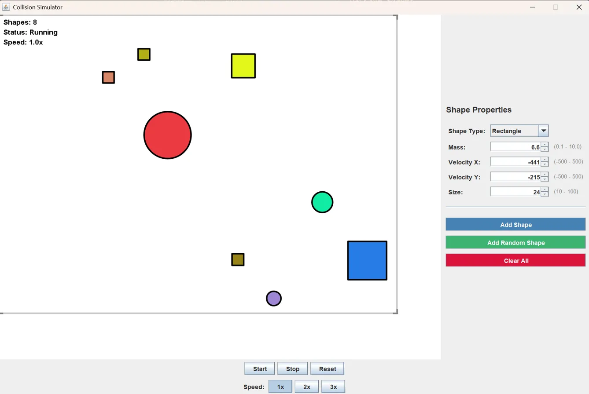

# Collision Simulator

A Java-based physics collision simulator that demonstrates elastic collisions between different geometric shapes with real-time visualisation and interactive controls.  



## Features

- **Multiple Shape Types**: Support for circles and rectangles
- **Real-time Physics**: Elastic collision simulation with momentum conservation
- **Interactive Controls**: Add shapes with custom properties
- **Visual Feedback**: Real-time rendering with collision detection
- **Speed Control**: Adjust simulation speed (1x, 2x, 3x)
- **User-friendly Interface**: Intuitive controls with input validation

## Prerequisites

- Java JDK 8 or higher
- Java Swing library (included with JDK)

## Installation

1. Clone the repository:
```
git clone https://github.com/RaynerGWH/CollisionSimulator
cd CollisionSimulator
```

2. Compile the program:
```
javac -d classes -cp "src" src/app/CollisionSimulator.java
```

3. Run the simulator:
```
java -cp "classes" app/CollisionSimulator
```


## Usage
### Adding Shapes

**Select shape type:** (Circle or Rectangle)

**Set properties:**

1. Mass (0.1 - 10.0)

2. Horizontal Velocity X (-500 - 500)

3. Vertical Velocity Y (-500 - 500)

4. Size (10 - 100)

5. Click "Add Shape" or "Add Random Shape"

### Controls

**Start:** Begin simulation

**Stop:** Pause simulation

**Reset:** Clear all shapes

**Speed:** Toggle between 1x, 2x, and 3x speed

**Clear All:** Remove all shapes from simulation

## Physics Properties

**1. Elastic Collisions:**

Conservation of momentum

Conservation of kinetic energy

**2. Collision Detection:**

Circle-circle: Distance-based detection

Rectangle-rectangle: Axis-aligned bounding box

Circle-rectangle: Closest point algorithm

**3. Principle of Conservation of momentum**

**4. Wall bouncing!**

## Future enhancements if I ever come back to work on this simulator again...

 Add more shape types (triangles, polygons)
 
 Implement shape rotation physics
 
 Add gravity and friction options
 
 Improve collision detection with spatial partitioning
 
 Add shape textures and visual effects

 Add collision sound effects...?
